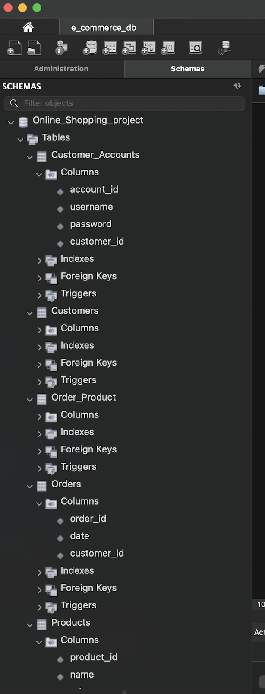
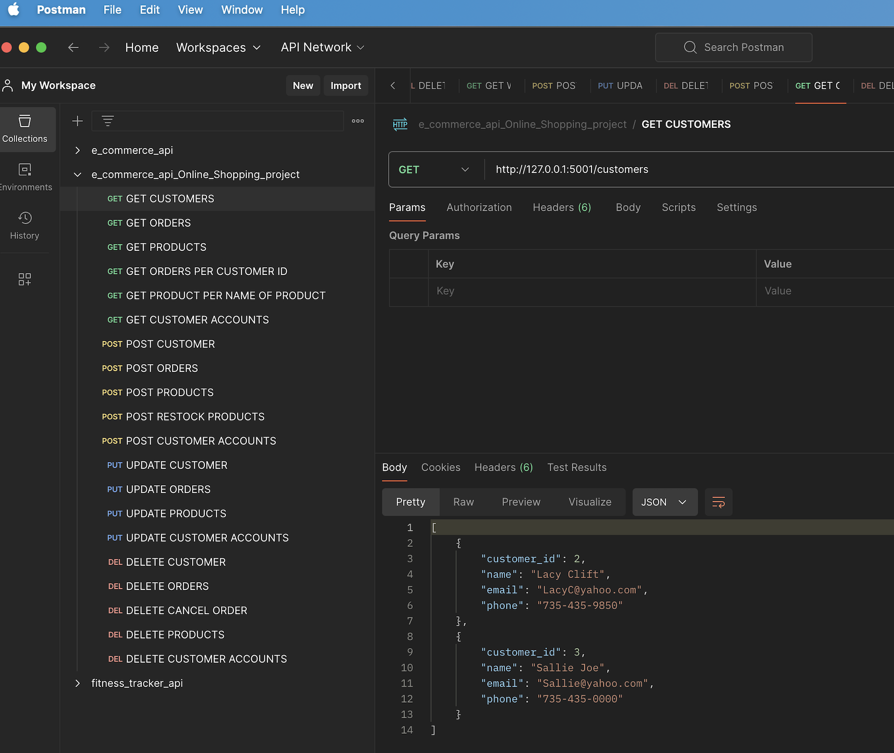

# E Commerce Online Shopping Application 

This e-commerce application was developed to empower both customers and administrators by building a user-friendly platform where customers can effortlessly browse products, add products to their shopping carts, and place orders. While administrators have tools to manage product inventory, track orders, and ensure a seamless shopping experience.

Key functionalities for this e-commerce application were developed including models, schemas, and endpoints for Customers, Products, Orders, and Customer Accounts.

## **Below are the key features and functionalities that this application includes:**
### Customer Management
- Create a customer
- Display details about a specified customer
- Display all customers  
- Update a customer 
- Delete a customer 
### Customer Account Management 
- Create a customer account 
- Display details about a customer account 
- Update a customer account 
- Delete a customer account 
### Product Catalog 
- Create a product 
- Display details about a specified product
- List all products  
- Update a product 
- Delete a product 
- Restock products when low 
### Order Processing
- Place an order 
- Retrieve details about a specified order 
- Retrieve all orders 
- Update an order 
- Delete an order 
- Track an order 
- Cancel an order that has not yet shipped or been completed 

## *Below is a screen shot of the mysql database that shows the design of the model to represent customers, orders, products, customer accounts, and a few additional features.* 

## *Below is a screen shot of the user interface, Postman, that shows collections that categorize and group API requests according to their functionality*

*link to GitHub Repository --> [e_commerce_api_online_shopping_project](https://github.com/Kayla-Ard/E_Commerce_API_Online_Shopping_Project)*
